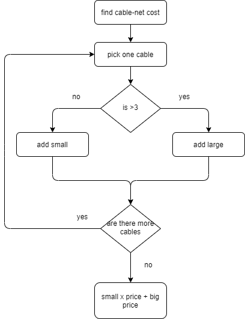
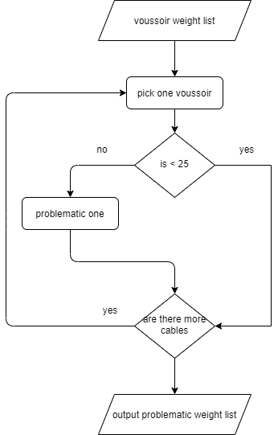
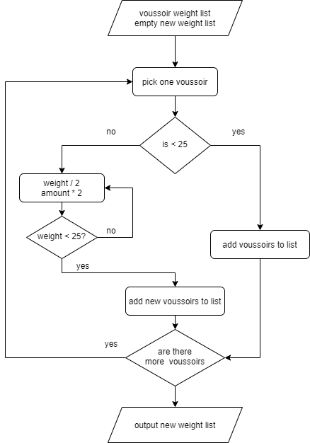

# Computational Structural Design II <br/> Intro to coding in Python and the Jupyter notebook I

### Learning Goal: 
- how to draw a flowchart
- how to translate a flowchart to pseudocode using **comments** in Python
- how to write basic Python script, including variable, object type, `if` condition, `print`, list, `for` loop, `while` loop, mathematical operators

### Content:
- [Cablenet Cost I](#ex1)
- [Voussoir Weight](#ex2)

### Exercise:
- [Cablenet Cost II](#tut1_ex)

<a id='ex1'></a>
# Cablenet Cost <br/>
## Question:
Suppose you have designed a cable-net made from steel cables. You are going to fabricate them and estimate the total cost. There are 2 different prices for cables longer than 3 meters and shorter than 3 meters, 5 Fr and 3 Fr correspondingly. Now you need to count how many cables are above 3 meters and how many are below, to calculate the cost. 

| Cable No. | Length (m) |
| :---: | :---: |
| 1 | 1.6 |
| 2 | 3.6 |
| 3 | 2.4 |
| 4 | 3.4 |
| 5 | 2.7 |
| 6 | 2.8 |
| 7 | 3.3 |
| 8 | 3.1 |
| 9 | 3.7 |
| 10 | 1.8 |
| 11 | 1.8 | 
| 12 | 2.6 | 

## Part A: Check Length of One Cable
Let's first break this problem down into small steps. Firstly, you could pick one cable and check whether its length is larger than 3 m. Secondly, you could repeat the first step to check all the cables, and then multiply the number of cables with the cost.

### A_1. Draw Flowchart
Firstly, we can draw a [**flowchart**](https://app.gitbook.com/o/-M57B1lKy7REE1wfeNSt/s/-M730QpQnbAMvz44bqhc/learn-to-code/i.-my-first-python-script/cheat-sheet#flowchart). 


<br/>

### A_2. Write pseudocode
Firstly, we could convert our flowchart to [**pseudocode**](https://en.wikipedia.org/wiki/Pseudocode#:~:text=In%20computer%20science%2C%20pseudocode%20is,reading%20rather%20than%20machine%20reading.), a plain-English version of the flowchart. 

The pseudocode are written in Python [**comments**](https://www.w3schools.com/python/python_comments.asp), which starts with a `#` and will not be excuated when we run the code. Comments help us to organize the logic when we start to write code, as well as in the future to keep track of and to understand the code. You can type `#` in front of the line you want to comment out. If you want to comment several lines, you can select the lines that need to be commented out, and press `ctrl + /`. 
# pick one cable
# if length larger than 3?
    # long cable 
# else
#     short cable
### A_3. Write your code
We could turn the pseudocode line by line into code. 


```python
# pick one cable
cable_length = 1.6
# if length bigger than 3?
if cable_length > 3:
    # long cable 
    print("This is a long cable.")
# else
else:
    # short cable
    print("This is a short cable.")
```

    This is a short cable.


## Part B: Check Length of All Cables

Let's complete the program. You need to repeat the whole process of checking the cable length until you have classified all cables. You could use another condition in your flowchart for the repetition instructions. After you have checked all the cables in your cable-net, you could count the amount in two length types and calculate the total cost. 

### B_1. Draw Flowchart



<br/>

### B_2. Write pseudocode
# pick one cable in the cable-net
#     if length larger than 3?
#         long cable amount + 1
#     else
#         short cable amount + 1
# repeat until the all the cables are checked
# calculate total cost
### B_3. Write the code
Here we need to input all the lengths of our cables. Instead of multiple length variables, we could store them in a collection - a [**list**](https://app.gitbook.com/o/-M57B1lKy7REE1wfeNSt/s/-M730QpQnbAMvz44bqhc/learn-to-code/i.-my-first-python-script/cheat-sheet#list). List items are ordered, or in other words, indexed, the first item has index ``0``, the second item has index ``1`` etc.


```python
cablenet = [1.6, 3.6, 2.4, 3.4, 2.7, 2.8, 3.3, 3.1, 3.7, 1.8, 1.8, 2.6]
print(cablenet[0])  # 1.6
print(cablenet[1])  # 3.6
print(cablenet[-1])  # 2.6
```

    1.6
    3.6
    2.6


To iterate over a list, we could use a [**``for``**](https://app.gitbook.com/o/-M57B1lKy7REE1wfeNSt/s/-M730QpQnbAMvz44bqhc/learn-to-code/i.-my-first-python-script/cheat-sheet#for-loop-and-while-loop) loop. 


```python
for cable in cablenet:
    print(cable)
```

    1.6
    3.6
    2.4
    3.4
    2.7
    2.8
    3.3
    3.1
    3.7
    1.8
    1.8
    1.8
    2.6


Now we go through the list, check the cable length one by one, and count the number of the corresponding type. Thus, we need to initiate the counter of two types at the beginning of our code. Here, we create two new variables: ``long_cable_count``, ``short_cable_count``, and set their initial value to ``0``. 


```python
# Input
cablenet = [1.6, 3.6, 2.4, 3.4, 2.7, 2.8, 3.3, 3.1, 3.7, 1.8, 1.8, 2.6]
long_cable_count = 0
short_cable_count = 0
long_cable_price = 5
short_cable_price = 3

# pick one cable in the cable-net, check its length
# repeat until the all the cables are checked
for cable in cablenet:
    # if length bigger than 3?
    if cable > 3:
        # long cable amount + 1
        long_cable_count += 1
    # else
    else:
        # short cable amount + 1
        short_cable_count += 1
# calculate total cost
total_cost = long_cable_count * long_cable_price + short_cable_count * short_cable_price

# Output
print("Total cost is", total_cost, "Fr.")
```

    Total cost is 49 Fr.


## Part C: Modify Cable Length

Oooops... You realize that you have calculated the length of a cable wrongly. Don't worry. The cable length list we use as input can be modified because list items are changeable. You could also modify a value in the ``cablenet`` list by referring to the item's **index**. Note that the index always starts from **``0``**! 

| Cable No. | Index | Length (m) |
| :---: | :---: | :---: |
| 1 | 0 | 1.6 |
| 2 | 1 | 3.6 |
| 3 | 2 | 2.4 |
| 4 | 3 | 3.4 |
| 5 | 4 | 2.7 |
| 6 | 5 | 2.8 |
| 7 | 6 | 3.3 |
| 8 | 7 | 3.1 |
| 9 | 8 | 3.7 |
| 10 | 9 | 1.8 |
| 11 | 10 | 1.8 | 
| 12 | 11 | 2.6 | 

For example, we find out the **3<sup>rd</sup>**  cable has the wrong length, whose corresponding index is ``2`` in the list. Find it, and change its value. 


```python
cablenet[2] = 2.5
print(cablenet)
```

    [1.6, 3.6, 2.5, 3.4, 2.7, 2.8, 3.3, 3.1, 3.7, 1.8, 1.8, 1.8, 2.6]


If we realize that we have omitted one cable that is 4 m, we could use ``append`` to add it at the end of our list. 


```python
print("We have", len(cablenet), "cables.")
print(cablenet)
cablenet.append(4.0)
print("After adding the new cable, we have", len(cablenet), "cables.")
print(cablenet)
```

    We have 15 cables.
    [1.6, 3.6, 2.5, 3.4, 2.7, 2.8, 3.3, 3.1, 3.7, 1.8, 1.8, 1.8, 2.6, 4.0, 4.0]
    After adding the new cable, we have 16 cables.
    [1.6, 3.6, 2.5, 3.4, 2.7, 2.8, 3.3, 3.1, 3.7, 1.8, 1.8, 1.8, 2.6, 4.0, 4.0, 4.0]


If you need to delete a cable you could either delete it by its index. For example, we want to delete the 4<sup>th</sup> cable in the list, whose index is ``3``. 


```python
cablenet.pop(3)
print(cablenet)
```

    [1.6, 3.6, 2.5, 2.8, 3.3, 3.1, 3.7, 1.8, 1.8, 1.8, 2.6, 4.0, 4.0, 4.0]


The cable can also be deleted by its value. If there are duplicated values, this method only removes the first matching element.


```python
cablenet.remove(3.1)
print(cablenet)
```

    [1.6, 3.6, 2.5, 2.8, 3.7, 1.8, 1.8, 1.8, 2.6, 4.0, 4.0, 4.0]


<a id='tut1_ex'></a>
## Exercise: Cables of 3 different Length 
Suppose there are three different prices for the cables: 2 Fr. for cables shorter than 2 m; 3 Fr. for cables between 2 m and 3 m; 5 Fr. for cables longer than 3 m. Could you modify your code and calculate the total cost?

Hint: <br/>
You need to classify 3 types of cables. When you run into a situation where you have several conditions, you can place as many elif conditions as necessary between the if condition and the else condition.


```python
# Input
# cable length of the cable-net
cablenet = [1.6, 3.6, 2.4, 3.4, 2.7, 2.8, 3.3, 3.1, 3.7, 1.8, 1.8, 2.6]

# please write down your answer here
```

---

<a id='ex2'></a>
# Check Voussoir Weight <br/>
## Question A: 
You have designed a freeform masonry vault and all the stone pieces are unique. You want to assemble the vault manually. However, on the construction site, the manual handling weight limit is 25 kg. Thus, you have to find the pieces that are too heavy and export their index. 

| CabVoussoirle No. | Weight (kg) |
| :---: | :---: |
| 1 | 15|
| 2 | 20 |
| 3 | 54 |
| 4 | 18 |
| 5 | 26 |
| 6 | 18 |

</br>

### A_1. Draw Flowchart



</br>

### A_2. Write pseudocode
# pick one voussoir in the vault
#     if weight heavier than 25
#         mark it as problematic voussoir
# repeat until all the voussoirs are checked
# output the problmatic voussoirs
### A_3. Write your code
Here, we will use the `enumerate` method of a list, which adds a counter when we iterate over the list.

TODO: Explain the enumeration.... 


```python
voussoir_weight_list = [15, 20, 34, 18, 26, 18]
for i, voussoir in enumerate(voussoir_weight_list):
    print("index", i, "value", voussoir)
```

    index 0 value 15
    index 1 value 20
    index 2 value 34
    index 3 value 18
    index 4 value 26
    index 5 value 18


We can create an empty list and add the index of the problematic voussoir in the list during our iteration. In the end, we can export the list.  The `*` operator unpacks the list.  


```python
voussoir_weight_list = [15, 20, 34, 18, 26, 18]
problem_index = []

# enumerate voussoirs in the vault:
for i, voussoir in enumerate(voussoir_weight_list):
    # check whether the weight is bigger than 25 kg
    if voussoir >= 25:
        problem_index.append(i)

print("Voussoir ", *problem_index, "are too heavy.")
```

    Voussoir  2 4 are too heavy.


## Question B: Optimize Voussoir Weight
Now you would optimize all the voussoirs that are too heavy by cutting them into two pieces while keeping the sequence of the voussoirs. 

### B_1. Draw Flowchart
We can continue from the last example. When the voussoir is too heavy, we need to first cut it in half, then check the weight of the half one. If the new weight is still too heavy, keep cutting. After cutting, we need to add the new cut stones back, so the sequence of the original voussoirs will not change. 



</br>

### B_2. Write pseudocode
# pick one voussoir in the vault
#     if weight heavier than 25
#         cut it the voussoir in half until the weight is below 25
#         replace the problematic voussoir with the new ones
# repeat until all the voussoirs are checked
# output the problmatic voussoirs
### B_3. Write your code
Here, we will use a **``while``** loop,  which keeps executing the code inside if the condition is True. The loop will stop when the condition is not fulfilled any more. For example, here we pick a voussoir that is 54 kg and the count is 1. The weight is too heavy. In the first iteration of the while loop, the voussoir will be cut in half, so the weight is divided by 2 and the count is multiplied by 2. Now, the while loop checks the new voussoir weight, which is 54 / 2 = 27. 27 is still bigger than 25, so the loop will keep running. The 27 kg voussoir is further cut in half and the count is multiplied by 2. Now the new weight is 27 / 2 = 13.5, which is smaller than 25. Thus, the while loop stops. 
Inside the while loop, we redeclare the value of the variable voussoir, variable count in every iteration. So, we can print the final value. 


```python
voussoir = 54
count = 1
while voussoir >= 25:
    voussoir /= 2
    count *= 2
print("Weight of the voussoir is", voussoir, 
      "and the total number of voussoirs is", count)
```

    Weight of the voussoir is 13.5 and the total number of voussoirs is 4


Now let's solve the problem. To notice that, when we iterate over the list, the items of the list cannot be modified. Thus, we create a new empty list: ``new_voussoir_weights``. After checking each voussoir, we can add the original voussoir or the processed smaller ones to the list. 


```python
# Input
voussoir_weight_list = [15, 20, 54, 18, 26, 18]
new_voussoir_weights = []

# enumerate voussoirs in the vault:
for i, voussoir in enumerate(voussoir_weight_list):
    # check whether the weight is bigger than 25 kg
    if voussoir >= 25:
        count = 1
        # cut the voussoir by half until it it less than 25 kg
        while voussoir >= 25:
            voussoir /= 2
            count *= 2
        new_voussoir_weights.extend([voussoir] * count)
    else:
        new_voussoir_weights.append(voussoir)

# Output
print(new_voussoir_weights)
```

    [15, 20, 13.5, 13.5, 13.5, 13.5, 18, 13.0, 13.0, 18]


---

## Answer to Cable Cost Exercise:


```python
# Input
# cable length of the cable-net
cablenet = [1.6, 3.6, 2.4, 3.4, 2.7, 2.8, 3.3, 3.1, 3.7, 1.8, 1.8, 2.6]


# initiate the cable class amount
long_cable_amount = 0
mid_cable_amount = 0
short_cable_amount = 0

# price of cable
short_cable_price = 2
mid_cable_price = 3
long_cable_price = 5


# check length of the cable
for cable in cablenet:
    if cable < 2:
        short_cable_amount += 1
    elif 2 <= cable <= 3:
        mid_cable_amount += 1
    else:
        long_cable_amount += 1

# calculate total cost
total_cost = long_cable_amount * long_cable_price + mid_cable_amount * mid_cable_price + short_cable_amount * short_cable_price

# Output
print("Total cost is", total_cost, "Fr.")
```

    Total cost is 43 Fr.

