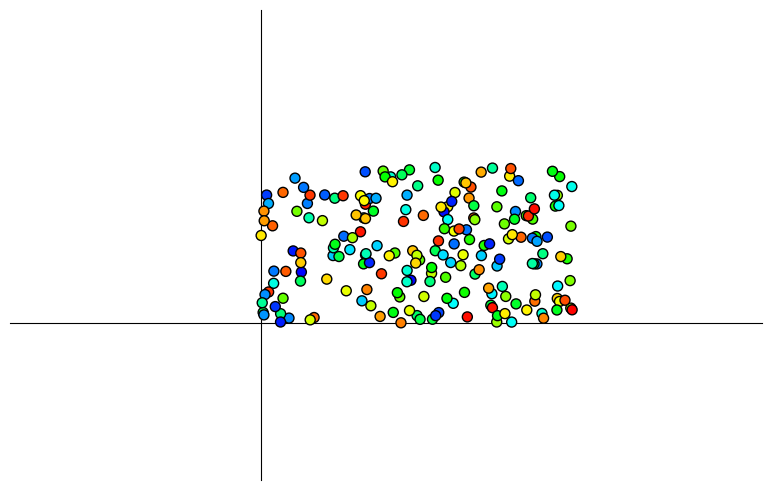

# Computational Structural Design II - Geometry, Data and Visualization

### Learning Goal: 
- Geometries
- data
- visualization

### Content:
- [A. Geometry Data](#GeometryData)
- [B. Geometry Class](#GeometryClass)
- [C. Data and Visualization](#visualization)

---


<a id='GeometryData'></a>
# A. Geometry Data

## A1. Describe a point in Rhinoceros Grasshopper
A point in 3D Cartesian coordinate system is represented by 3 numbers, which represents values along x, y and z axis. If you are familiar with Rhino and Grasshopper, a point can be created numerically by inputing 3 values. 

</br>

<center>create a point in Rhinoceros Grasshopper 3D</center>
</br>

## A2. Describe a Point by Python list
Similarly the point can be referred to as a list `[x, y, z]` in Python. The three numbers represent the xyz coordinates of the point. Since a point is described as a list, the value in the list can be retrieved, modified, and updated by accessing the corresponding index of the list. 
Here we create a point `x=0, y=1, z=1` and change the coordinate `y=5`. 


```python
# xyz coordinates of the point
my_point = [0, 5, 2]  
print("y coordinate of my_point is", my_point[1])

# re-assign the y coordinates 5
my_point[1] = 5  
print("xyz coordinates of my_point are", my_point)
```

    y coordinate of my_point is 5
    xyz coordinates of my_point are [0, 5, 2]


## A3. Geometry Data Summary
Besides point, basic geometry types - such as vector, line, plane - can be described numerically in Python by **lists of values**. The length of the list corresponds with the number of dimensions of the space the geometry resides in. In 3D space, the list contains 3 elements. The following table demonstrates the data used to describe 3D geometries numerically. 


<table style='float:center;'>
    <tr>
        <th style='text-align: center'>Geometry</th>
        <th style='text-align: center'>Data</th>
        <th style='text-align: center'>Description</th>
    </tr>
    <tr>
        <td style='text-align: center'>point</td>
        <td style='text-align: center'>[x, y, z]</td>
        <td style='text-align: center'> </td>
    </tr>
    <tr>
        <td style='text-align: center'>vector</td>
        <td style='text-align: center'>[x, y, z]</td>
        <td style='text-align: center'> </td>
    </tr>
    <tr>
        <td style='text-align: center'>line</td>
        <td style='text-align: center'>([x<sub>1</sub>, y<sub>1</sub>, z<sub>1</sub>], [x<sub>2</sub>, y<sub>2</sub>, z<sub>2</sub>])</td>
        <td style='text-align: center'>(start point, end point)</td>
    </tr>
    <tr>
        <td style='text-align: center'>plane</td>
        <td style='text-align: center'>([x<sub>0</sub>, y<sub>0</sub>, z<sub>0</sub>], [x<sub>n</sub>, y<sub>n</sub>, z<sub>n</sub>])</td>
        <td style='text-align: center'>(origin, normal)</td>
    </tr>
    <tr>
        <td style='text-align: center'>circle</td>
        <td style='text-align: center'>[([x<sub>0</sub>, y<sub>0</sub>, z<sub>0</sub>], [x<sub>n</sub>, y<sub>n</sub>, z<sub>n</sub>]), r]</td>
        <td style='text-align: center'>[(origin, normal), radius]</td>
    </tr>
    <tr>
        <td style='text-align: center'>polyline</td>
        <td style='text-align: center'>([x<sub>1</sub>, y<sub>1</sub>, z<sub>1</sub>], [x<sub>2</sub>, y<sub>2</sub>, z<sub>2</sub>], [x<sub>3</sub>, y<sub>3</sub>, z<sub>3</sub>, ...])</td>
         <td style='text-align: center'>collection of points</td>
    </tr>
    <tr>
        <td style='text-align: center'>polygon</td>
        <td style='text-align: center'>([x<sub>1</sub>, y<sub>1</sub>, z<sub>1</sub>], [x<sub>2</sub>, y<sub>2</sub>, z<sub>2</sub>], [x<sub>3</sub>, y<sub>3</sub>, z<sub>3</sub>, ...])</td>
         <td style='text-align: center'>collection of points</td>
    </tr>
    <tr>
        <td style='text-align: center'>frame</td>
        <td style='text-align: center'>([x<sub>0</sub>, y<sub>0</sub>, z<sub>0</sub>], [x<sub>1</sub>, y<sub>1</sub>, z<sub>1</sub>], [x<sub>2</sub>, y<sub>2</sub>, z<sub>2</sub>])</td>
         <td style='text-align: center'>[origin, vector, vector]</td>
    </tr>
</table> 
    
</br>

---

<a id='GeometryClass'></a>
# B. Geometry Class
A geometry type can be described by data. We can use a **Class** as a constructor, a template, or a "blueprint" to create **Objects** of a certain geometry type. An **Object** is an instance of a **Class** and it shares all attributes and the behavior of the Class. Classes are used frequently in Python scripting. A class can not only store data, but also define methods (a object-oriented programming term for functions) alongside the data that they operate on and produce. 

In the following session, we will learn Python Class by creating our own **Point class**. Then we will use the class to create a **Point object**, which represents the point `x=0, y=1, z=1`. 

## B1. Point Class
### B1_a. Create a Class
Class definition cannot be empty. Put the `pass` statement to avoid getting an error. 


```python
class Point:
    """ Point class"""
    pass

pt = Point()  # instantiate an object of Point
print(pt) # by default, print the name of the object’s class and the address of the object. 
```

    <__main__.Point object at 0x7fb6c808a0a0>


### B1_b. `__init__()` function
All classes have a function called `__init__()`, which is always executed when the class is being initiated. We can pass some initial values to the class by calling the `__init__()` function. Before the parameters `x`, `y`, `z`, there is a `self`, which refers to the object itself. Then, we need to create new fields also called `x`, `y`, `z`. Notice `self.x` and `x` are two different variables even though they are both called `x`. You can view the dotted notation `self.x` as the attribute of your Point object, and the other x is a local variable. 


```python
class Point:
    """ Point class"""
    
    def __init__(self, x, y, z):
        self.x = x
        self.y = y
        self.z = z

pt = Point(1, 1, 0) # create a point object
print("xyz coordinates are:", pt.x, pt.y, pt.z)
```

    xyz coordinates are: 1 1 0


### B1_c. Object Method
Now let's add a method to Point class to translate the point. It modifies the object attribute `self.x`, `self.y`, `self.z` by adding the translation distance along the corresponding axis.  


```python
class Point:
    """ Point class"""
    
    def __init__(self, x, y, z):
        self.x = x
        self.y = y
        self.z = z
    
    def translate(self, vec_x, vec_y, vec_z):
        """Translate this point along a 3d vector"""
        self.x += vec_x
        self.y += vec_y
        self.z += vec_z

pt = Point(1, 1, 0) # create a point object
print("xyz coordinates before translation are:", pt.x, pt.y, pt.z) 
pt.translate(1,3,1) 
print("xyz coordinates after translation are:", pt.x, pt.y, pt.z) 
```

    xyz coordinates before translation are: 1 1 0
    xyz coordinates after translation are: 2 4 1


### B1_d. Modify Object Properties
Properties on objects can be modified.


```python
pt.x = 3
print("xyz coordinates after modification are:", pt.x, pt.y, pt.z) 
```

    xyz coordinates after modification are: 3 4 1


## B2. Use the Point Class from COMPAS
COMPAS contains a [Point](https://compas.dev/compas/latest/api/generated/compas.geometry.Point.html?highlight=point#compas.geometry.Point) class which is similar to the one we have created. However, it contains more object methods which have already been developed. In a COMPAS Point class, a Point has three parameters, `x`, `y`, `z`. They could be accessed through indexing as well as through `.x`, `.y`, and `.z` attributes. 


```python
from compas.geometry import Point

my_point = Point(0, 1, 1)  # create a point object
print(my_point.y)  # attribute y of point
print(my_point[1] == my_point.y)

my_point.y = 5  # reassign the attribute y
print(my_point) # Point class contains a class function that prints the summary of the object
```

    1.0
    True
    Point(0.000, 5.000, 1.000)


## B3. Geometry Classes in COMPAS
COMPAS provides a number of ready-to-use primitive objects. Available primitive objects include `Point`, `Vector`, `Line`, `Plane`, `Polyline`, `Polygon`, `Circle`, `Frame`, etc. All COMPAS primitives can be used interchangeably with native Python objects as input for geometry functions and object methods. 
For a complete overview, you can visit the [API Reference](https://compas.dev/compas/latest/api/compas.geometry.html). 

<br/>
<table style='float:center;'>
    <tr>
        <th style='text-align: center'>Geometry Object</th>
        <th style='text-align: center'>COMPAS Class</th>
    </tr>
    <tr>
        <td style='text-align: center'>point</td>
        <td style='text-align: center'>point = Point(x, y, z)</td>
    </tr>
    <tr>
        <td style='text-align: center'>vector</td>
        <td style='text-align: center'>vector = Vector(x, y, z)</td>
    </tr>
    <tr>
        <td style='text-align: center'>line</td>
        <td style='text-align: center'>line = Line(point, point)</td>
    </tr>
    <tr>
        <td style='text-align: center'>plane</td>
        <td style='text-align: center'>plane = Plane(point, vector)</td>
    </tr>
    <tr>
        <td style='text-align: center'>circle</td>
        <td style='text-align: center'>circle = Circle(plane, radius)</td>
    </tr>
    <tr>
        <td style='text-align: center'>polyline</td>
        <td style='text-align: center'>polyline = Polyline(points)</td>
    </tr>
    <tr>
        <td style='text-align: center'>polygon</td>
        <td style='text-align: center'>polygon = Polygon(points)</td>
    </tr>
    <tr>
        <td style='text-align: center'>frame</td>
        <td style='text-align: center'>frame = Frame(point, vector, vector)</td>
    </tr>
</table> 
<br/>


```python
from compas.geometry import Point, Line

line_1 = Line([0, 0, 0], [2, 0, 0])
line_2 = Line(Point(0, 0, 0), Point(2, 0, 0))

print(line_1 == line_2)
```

    True


---

<a id='visualization'></a>
# C. Data and Visualization
After we generate the geometry objects, we can use a visualization interface to translate the information into a visual context. Firstly, We need a "drawing surface" - a canvas in 2D, or a scene in 3D. A 2D canvas can contain a number of shapes, which contains not only the geometric data - such as the coordinates, but also graphics context. Graphics context means objects that provide mechanisms for displaying the geometry, such as color, width of the curve. 

### TODO: add diagram about data, artist, plotter...

## C1. compas.geometry and 


```python

```


```python

```


```python

```


```python

```


```python

```

## Geometry Operations
transformation, cross product


```python

```


```python

```


```python

```


```python

```


```python

```


```python
from compas.geometry import Point

point1 = Point(0, 0, 0)
point2 = Point(0, 1, 0)
point3 = Point(3, 2, 0)

```


```python
from random import random

from compas.geometry import Pointcloud
from compas.utilities import i_to_rgb
from compas_plotters import Plotter
```


```python
import matplotlib
matplotlib.pyplot.ion()

# Pointcloud Geometry
pcl = Pointcloud.from_bounds(10, 5, 0, 100)

# Plotter
plotter = Plotter(show_axes=True)

# TODO: How to clear the plotter?!

for point in pcl.points:
    plotter.add(point, facecolor=i_to_rgb(random(), normalize=True))

# plotter.zoom_extents()
from IPython.display import display
fig = plotter.figure
display(fig)
```


    

    


```python

```


```python

```


```python

```


```python

```


```python

```
