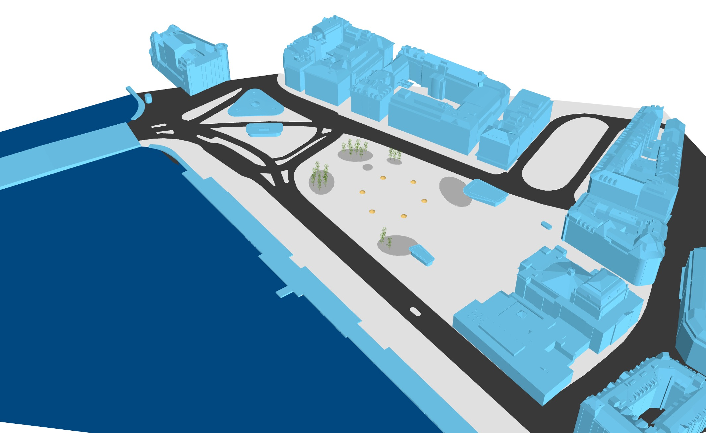
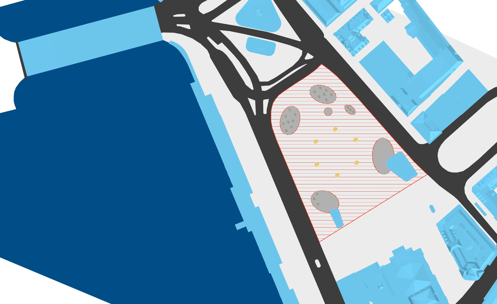

# Assignment 3


Complete the tasks below, and submit a zipped folder that includes&#x20;

1. the completed files or other deliverables&#x20;
2. and the PDF&#x20;

by **15:00 on Thursday, May 19th**.&#x20;

Please follow the file naming convention as shown in the [**Syllabus**](../../syllabus.md).  \

### [Submit assignment 3 here.](https://www.dropbox.com/request/8eLJIcF0pSEq9rELs0FT)


### Tasks

Assignment 3 is organized in three interrelated tasks:

1. Design Task - Formfinding of a funicular shell in RV2
2. Rationalization and materialization utilizing the COMPAS framework in JupyterNotebook / Google Colab
3. Fabrication Workflow for WireCutting (HWC or DWC) in the COMPAS framework in JupyterNotebook / Google Colab
4. Documentation and Communication of Design Results
5. Documentation and Communication workflows and Code&#x20;

The work is designed to be carried out in groups of 3-5.

The work will be carried out in class throughout 2 workshop-style worksessions under the supervision of the CSD2 Tutor team. The planned dates for the work are (Week 11 - 5May - 3Hours and Week 12 - 12 May 3Hours)

Group presentations 19 May 2022, in class, after guest lecture&#x20;

## 1.Design Brief

.png>)

In order to apply the knowlege acquire throughout the CSD2  in a realistic design scenario, you will be asked to use all the techniques we will have presented throughout the course to design a shell structure in the public space of the Sechseläutenplatz in Zurich, Switzerland.&#x20;

Design a free-form shell for [Sechseläutenplatz in Zurich](https://goo.gl/maps/JaMvwPPMruYewLMFA).&#x20;

The surface of the shell may have a maximum area of approx. **200-250 square meters** and a maximum **16 meter span**.&#x20;

The shell may land around, but not in or on the existing site obstacles (umbrellas, trees and dark grey areas).&#x20;

The shell must be inside the red area shown in the image below.&#x20;

The height of the shell should be at least **2.5 meters**, so that it can be used as a passageway as well as a covering for the plaza.

Use the RV2 commands for creating Patterns from geometric features. You are free to add features and customise your shell.

The segmentation of the shell must be coordinated with the constraints of your chosen fabrication technology and the proper machine size and parameters.

The shell must be in horizontal and vertical equilibrium.

Tips and design considerations

* For my given site and my design intent, which method of RV2 pattern generation is appropriate?
* What types of existing boundary condition constraints do I need to taken into account?
* How does my pattern generation and modification strategies influence my choice of material and other fabrication and construction schemes?
* How can I control and modify the geometry of the force diagram to refine the shape of the Thrust Diagram?
* Have I considered how the landings and openings of the Thrust Diagram relate to the program and the intended use of the space underneath?

**Use the following 3Dmodel to develop your design.**


3Dmodel of the site in Zurich


## 2.Geometry, Rationalisation, and Materialisation Brief

In this part of the assignment, we will generate polygon blocks for the form-found funicular shell**.** Use the Tutorial 7  / Assignment 2 workflow on the form-found resulting mesh to materialise your design. If you are working with triangle mesh, you can refer to Tutorial 7. If you are working with triangle mesh, you can refer to Assignment 2.&#x20;

****

### Steps:

* **A. Load Your form-found Mesh**
* **B. Compute Tessellation Pattern**\
  The input mesh is a quad mesh, A hexagonal polygon can be generated with the vertices around two adjacent quad faces. You can modify the vertex coordinates in the quadmesh. Serialize the modified quad mesh.\
  Secondly, find the correct vertices in each block. Create a list,`block_faces`, and save the vertices on each block as a list in `block_faces`. Serialize the `block_faces`.\
  Visualize the blocks as `Polygon` in the viewer.\

* **C. Generate Blocks**\
  Create a function `generate_block`. The input parameter is **the modified quad mesh**, **vertices on one block**, and **thickness of the block**. The function should return a 3D block, which has a planar top surface.\
  Call the function to generate all the blocks for the barrel vault. Serialize the blocks and visualize them in the viewer.

## 3. Fabrication Brief

Use the assignment 3 jupyter notebook along with tutorial 9. The intent is for you to now take your own generate blocks and develop a workflow to wirecut two of them out of blank material.&#x20;



### Steps:

* **A. Load your** **generated blocks into the notebook**
*   **B. Determine the largest bounding box needed for a block**

    The current workflow finds a bounding box for the block and generates a blank material of that same box scaled up by a factor of `1.10`. Draw a flow diagram, then write the pseudocode, and finally implement a loop that `for block in blocks` finds the largest required bounding box dimensions.&#x20;
*   **C.  Generate two standard blank material boxes**

    After finding the dimensions of the largest bounding box, use those dimensions to generate a blank block from which to cut your two blocks, and then scale up that blank by `1.10`. The location of these blocks should be `1.5`m and `-1.5`m along the `x-axis` from the base of the wirecutting arm (see plan drawing). The base of the blank should be vertically aligned with the base of the wirecutting arm (see elevation drawing).

*   **D.  Implement the rest of the workflow on both blocks**

    The code from tutorial 9 performs the wirecutting workflow on a singular block. While the rest of the steps remain the same, import the code and edit it to implement the workflow on both of your blocks.

## 4a. Deliverables for Group Presentations

On the last CSD2 Course session, on May 19th, you will be asked to present your design proposals to the instructors . Before the start of Friday's 1st session, please compile the material below into a zip file (Your\_GroupName.zip), and upload it using the link in the header of this page.

### 1. Images(10-12)

* 16x9 format, 1920x1080 resolution min
* These images may include but are not limited to:
  * Site strategy diagrams
  * Concept sketches and design development
  * Pattern generation techniques and development
  * evolution and refinement of form and force diagrams
  * block generation, rationalization, and materialisation snapshots
  * fabrication strategies and development
  * block cutting sequence and explanation
  * points of improvement/outlook
  * perspectives/renderings
* Your\_Group\_Name\_\_##.png

### 2. Presentation board

* Presentation board (16x9 format, 1920x1080 resolution min.) summarising the design project
* This board can be an organized compilation or a collage of the 10-12 images from above
* Your\_Group\_Name\_board.pdf (or jpg/png)

### 3. .rv2 session file (s)

* Final or a series of .rv2 session files&#x20;
* Your\_Group\_Name\_##.rv2

### 4. .3dm rhino file

Include Rhino files of the final design, including the shell geometry as well as any materialisation and fabrication developments.

* The Rhino file may be used interactively in your presentation
* The Rhino file may be used to give an overview of materialization and fabrication developments

### <mark style="color:blue;">5. .txt file with the Name\_Surname of the Group members</mark>

## 4b.Deliverables for the Fabrication Task

Use the Assignment 3 Jupyter Notebook to develop your answer.

Then answer the questions on the following document:

Placeholder Assignment 3 Template
