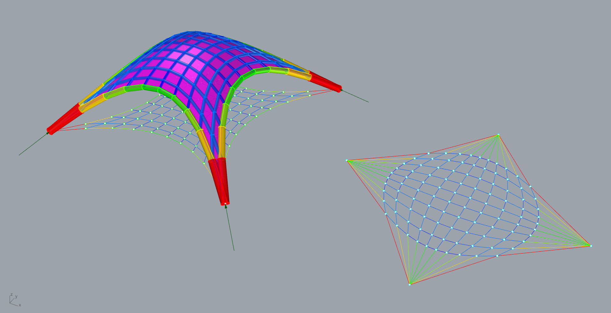

# RV2

The Rhinoceros® plug-in RhinoVAULT, developed by Dr. Matthias Rippmann at the Block Research Group at ETH Zurich, emerged from research on structural form finding using the Thrust Network Analysis (TNA) approach to intuitively create and explore compression-only structures.

Using reciprocal diagrams, RhinoVAULT provides an intuitive, fast funicular form-finding method, adopting the same advantages of techniques such as Graphic Statics, but offering a viable extension to three-dimensional problems. Our goal is to share a transparent setup to let you not only create beautiful shapes but also to give you an understanding of the underlying structural principles.

RhinoVAULT 2 (RV2) is an open-source research and development platform for funicular form-finding built with [COMPAS](https://compas-dev.github.io), a Python-based framework for computational research and collaboration in Architecture, Engineering, and Digital Fabrication.

RV2 is a Rhino plugin that replaces RhinoVAULT for Rhino versions 6 and above. Unlike RhinoVAULT, RV2 no longer relies on Rhino for its computational implementation. Instead, it is built entirely with open source packages from the COMPAS ecosystem and will, therefore, be available not only for Rhino and Grasshopper, but also for Blender and other tools with a Python scripting interface, and ultimately even in the browser.

For more information about RV2, please visit the [RV2 documentation](https://blockresearchgroup.gitbook.io/rv2/).

## 0. Preparation 

Open Rhino and run the command `EditPythonScript` once, then exit Rhino (this will initialize some internal Rhino folder structure which is necessary for the installation of RV2).​

## 1. Download 

Download latest RV2 (v1.1.4) installation file from [https://github.com/BlockResearchGroup/compas-RV2/releases/tag/v1.1.4](https://github.com/BlockResearchGroup/compas-RV2/releases/tag/v1.1.4).​

## 2. Install 

Run the installation file. If you see following prompt, click on `More info` then choose `Run anyway`&#x20;

After the installation interface shows up, click on the **`Install RV2`** button, then choose a location to install RV2 on your computer.

After the installation interface shows up, click on the **`Install RV2`** button, then choose a location to install RV2 on your computer.


RV2 is a Rhino plugin. It is not software. We just need an installation location to set up some of the dependencies for the plugin.&#x20;

Therefore, you can choose any folder for the installation, as long as there are no spaces in the installation path!\
\
Paths like`D:\Program Files\...`will fail to install.\
\
However, please, **don't use your "Program Files" folder for the installation** process since this requires special admin privileges. Instead, use something like:\
\
`C:/Tools`\
`C:/RhinoVault2`\
`C:/DF2020`\
`C:/Users/username/Documents`\
`C:/Users/username/Desktop`


The installation usually takes 1\~2 minutes. After the progress bar finishes, click **`Yes`** twice in User Account Control.

The installation is successful if you see this message:


Note that you have to close the installer window after the installation.&#x20;


## 3. Activate Toolbar in Rhino

In the top menu, go to `Tools > Toolbar Layout`.

In the pop-up window, click `File > Open`.&#x20;

Go to the location where your RV2 is installed, for example `D:\MySoftwares\RV2\` , enter the folder called `dev` then find the file `RV2.rui` and open it.

Tick `RV2` in the Toolbars section.

The RV2 menu and toolbar will now both appear in user interface.

## 4. Initialise RV2

To check that everything worked, click the `Initialise RV2` menu item or toolbar button. You will be asked to accept the "Terms and Conditions" and "User Agreement" (just click `Yes` :) after which the welcome screen should disappear.

If the initialization step fails, please file an issue on the [RV2 issue tracker](https://github.com/BlockResearchGroup/compas-RV2/issues/) and we will help you as quickly as possible.

If Rhino says `Command not found: -_RV2init`, please type `EditPythonScript` to open the script editor and restart Rhino. Then try the initialisation again.

